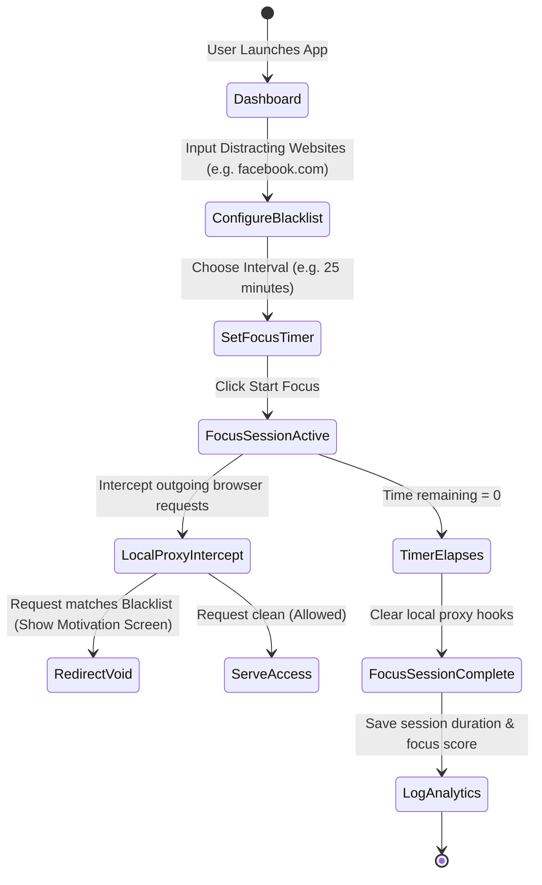
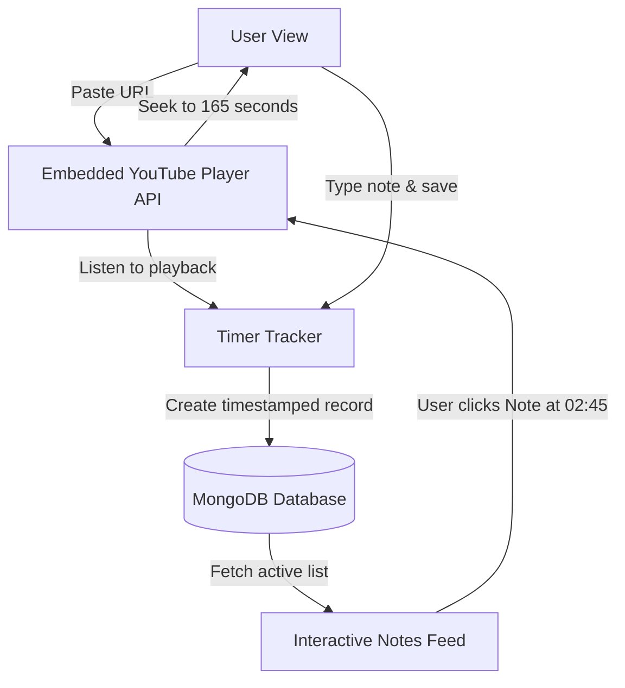

<div align="center">

<!-- Waving Indigo/Purple Gradient Banner -->


<br/>

<!-- Interactive Typing Header -->
<h1>
  
</h1>

<p align="center">
  
  
  
  
  
</p>

</div>

---

## ⚡ The Ultimate Productivity Ecosystem

**Focus Fuze** is a comprehensive, full-stack **task management and productivity workspace** engineered to unify collaboration, goal alignment, structured documentation, and active distraction management. By integrating live team task comments, calendar synching, AI-driven auto-summarized personal notes, Auth0 secure routing, and a smart website blocker for Deep Focus mode, Focus Fuze is designed to keep you aligned and undistracted.

---

## 🚀 Key Modules & System Matrix

<div align="center">

| Module Area | Core Functionality | User Experience Advantage |
| :--- | :--- | :--- |
| **🎯 Goal Manager** | Personal & Shared Team Goal pipelines, milestone checklists. | Color-coded indicators tracking progressive completion |
| **📝 Smart Notes** | Embedded AI Auto-Summary engine for fast reading. | One-click markdown summaries of long entries |
| **🎥 Video Notes** | Integrated YouTube note-taking engine with timestamp tags. | Clicking a note jumps the video directly to that timestamp |
| **🚫 Blocker Hub** | Active domain blocking during focus timers. | Prevents access to blacklisted websites during focus sessions |
| **📅 Integrations** | Real-time Google Calendar deadline synchronization. | Automated task deadlines mapped onto personal schedules |

</div>

---

## 🏗️ Interactive System Architecture

Explore the operational lifecycles and background loops that govern Focus Fuze:

<details>
<summary>🚫 <b>1. The Deep Focus Blocker Pipeline</b></summary>
<br/>

Trace how the active blocker intercepts sessions during focus intervals:


</details>

<details>
<summary>🎥 <b>2. YouTube Note-Taking Ecosystem</b></summary>
<br/>

The custom YouTube notes engine links player state timecodes directly with database records:


</details>

---

## 💻 Tech Stack & Dependencies

```
🌐 FRONTEND WEB  :: React.js • Tailwind CSS • Axios • Auth0-React
🧬 BACKEND CORE  :: Node.js • Express.js • MongoDB • Mongoose
🔐 SECURE AUTH   :: Auth0 OAuth 2.0 Single Sign-On
📅 CALENDAR API  :: Google Calendar API Integration
🎥 VIDEO API     :: YouTube IFrame Player API
🚫 BLOCKER PROXY :: Local hosts-file / extension-based interceptor hooks
```

---

## 📂 Project Directory Structure

```
focus_fuze/
├── Backend/                      # Node/Express Service
│   ├── config/                   # Auth0 & database credentials
│   ├── controllers/              # Goal, Task, Note, and Blocker API controllers
│   ├── models/                   # Schemas (User, Task, Goal, VideoNote)
│   ├── routes/                   # Route handlers
│   └── server.js                 # Express bootstrap startup
└── Frontend/                     # Vite React Client
    ├── src/                      # Source modules
    │   ├── components/           # Widgets (VideoPlayer, GoalCard, TaskList)
    │   ├── pages/                # Views (Dashboard, Notes Workspace, Calendar)
    │   ├── styles/               # Tailwind stylesheets
    │   └── App.jsx               # Navigation & Auth0 context wrappers
```

---

## ⚙️ Interactive Customization Terminal

Explore how to configure the focus blocker or customize the note-taking parameters:

<details>
<summary>🚫 <b>1. Configuring Blocker Redirection URLs</b></summary>

You can alter the motivational page that users see when trying to access blacklisted sites. Open [Backend/controllers/blockerController.js](file:///c:/Users/admin/Desktop/focus_fuze/focus_fuze/Backend/controllers/blockerController.js):
```javascript
const MOTIVATIONAL_REDIRECT = "https://focus-fuze.com/stay-focused";

export const handleBlockedRequest = (req, res) => {
  res.redirect(302, MOTIVATIONAL_REDIRECT);
};
```
</details>

<details>
<summary>🎥 <b>2. Customizing YouTube Player Controls</b></summary>

Modify player options like disabling annotations or related videos. Open [Frontend/src/components/VideoPlayer.jsx](file:///c:/Users/admin/Desktop/focus_fuze/focus_fuze/Frontend/src/components/VideoPlayer.jsx):
```javascript
const playerOptions = {
  height: '390',
  width: '640',
  playerVars: {
    autoplay: 0,
    rel: 0,           // Disable related videos at end
    controls: 1,      // Show player controls
    modestbranding: 1 // Hide YouTube logo overlay
  }
};
```
</details>

---

## 🚀 Setup & Launch Protocol

### 1. Configure backend Environment
Create a `.env` file inside the `Backend` directory:
```env
PORT=5000
MONGO_URI="mongodb+srv://<user>:<password>@cluster.mongodb.net/focusfuze"
AUTH0_AUDIENCE="https://your-auth0-domain.com/api/v2/"
AUTH0_ISSUER="https://your-auth0-domain.com/"
GOOGLE_CALENDAR_CLIENT_ID="YourGoogleClientID"
GOOGLE_CALENDAR_CLIENT_SECRET="YourGoogleSecret"
```

### 2. Configure Frontend Client Environment
Create a `.env` file inside the `Frontend` directory:
```env
VITE_API_BASE_URL="http://localhost:5000/api"
VITE_AUTH0_DOMAIN="your-auth0-domain.com"
VITE_AUTH0_CLIENT_ID="YourAuth0ClientID"
VITE_AUTH0_AUDIENCE="https://your-auth0-domain.com/api/v2/"
```

### 3. Launch Backend
```bash
cd Backend
npm install
npm start
```

### 4. Launch Frontend
```bash
cd ../Frontend
npm install
npm run dev
```
Open **[http://localhost:5173](http://localhost:5173)** in your browser to enter your unified productivity workspace!

---

## 📄 License
This project is licensed under the terms of the **MIT License**.

---

<div align="center">

### 🌟 Vibe High, Stay Focused!
*Bridge the gap between task planning and absolute concentration.*


</div>
